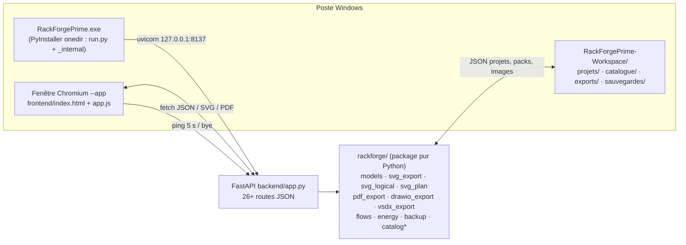

# DAT — RackForgePrime v1.7.1

**Dossier d'Architecture Technique de l'application** — écrit le 04/09/2026, code expliqué
étape par étape. Règle d'or reprise du dossier Ingénieur Réseau : *un autre ingénieur doit
pouvoir reconstruire, compiler, déployer et faire évoluer l'application sans téléphoner.*

> Le disque fait foi : chaque chiffre ci-dessous est recompté (commande donnée) ; ce qui n'a
> pas été vérifié est marqué **[à vérifier]**.

---

## 0. Fiche d'identité

| Élément | Valeur |
|---|---|
| Nom | RackForgePrime (logo « slot forgé », icône `assets/icon.ico`) |
| Version | **1.7.1** (`backend/app.py` `VERSION` + badge `#brand-version` de `frontend/index.html`, toujours bumpés ensemble) |
| Nature | Application **de bureau 100 % locale** : serveur FastAPI + fenêtre Chromium `--app` (aucun cloud, aucun appel sortant) |
| Métier | Schémas de baies réseau à l'échelle réelle EIA-310, vue logique VLAN/liens, plan d'étage, brassage, dossier DAT PDF, exports SVG/PNG/draw.io/VSDX |
| Espace de travail projet | `C:\Users\koyon\Desktop\CITADEL\RACKFORGEPRIME\` (règle : tout au même endroit) |
| Code | `fng-legal\rackforgeprime\` (dépôt git `fng-legal`, branche `claude/rackforgeprimes-foundations-y41pt4`) |
| Exe déployé | **Kit portable** : un seul dossier (`RackForgePrime.exe` + `_internal\` + `RackForgePrime-Workspace\` + `LANCER-*.bat`). Copiable USB / autre PC |
| Éditions | `--edition pc` (fenêtre), `web` (navigateur), `phone` (`0.0.0.0` + IP LAN). Lanceurs dans `portable/` recopiés à côté de l'exe |
| Port | 8137 (exe) ; dev `run.py --port 8138+` |
| Python | 3.13 (`.venv`) ; FastAPI, Uvicorn, Pydantic v2, reportlab + svglib (PDF), Pillow, pyyaml, pypdf, PyInstaller |
| Tests | `python -m pytest tests -q` + `python scripts/smoke_editions.py` (PC / Web / Phone + kit déplacé) |
| Journal de bord | `00-CONTEXTE.md` (sections « Pont d'Hemingway », la dernière fait foi) |
| Guide utilisateur | `GUIDE-UTILISATEUR.md` (copie `portable/GUIDE-UTILISATEUR.md`, assemblé dans le kit) |

---

## 1. Contexte et besoin (renvoi CDC)

**Pourquoi** : Panther (ingénieur réseau) voulait un outil de schémas de baies « aussi complet
que Visio ou draw.io mais en qualité supérieure » pour ce métier, avec des livrables
générés depuis la donnée (jamais dessinés à la main) — brassage, étiquettes, nomenclature,
dossier DAT — et une vraie application de bureau, solide et fluide.

**Exigences gravées** (ne jamais revenir dessus) :

| # | Exigence | Où elle vit |
|---|---|---|
| E1 | **Échelle réelle EIA-310 au mm** : façade 19" = 482,6 mm, 1U = 44,45 mm, `RACK_W = 440 px` → `U_PX = 40.5` ; images toujours `preserveAspectRatio="xMidYMid meet"` (jamais d'étirement) ; boîtier compact = `width_mm` réel | `svg_export.py` + `app.js` (constantes miroir) |
| E2 | **Une seule source de rendu** : l'écran est le SVG d'export, le PDF est la conversion du SVG | `svg_export.py`, `svg_logical.py`, `svg_plan.py`, `pdf_export.py` |
| E3 | **Aucun nom écrit sur le dessin** sauf hostname saisi **et** toggle « Noms » actif (masqué par défaut en vue physique depuis v1.6.0) ; le reste vit au survol (`<title>`), fiche et tableaux | `render_rack()`, `drawFaceplate()`, `rfp-noms` |
| E4 | **Un dessin = une image** : tout type posé reçoit une vraie photo de façade DE FACE ; un modèle « [à vérifier] » ne reçoit jamais la photo d'un voisin deviné | pipeline images, `bibliotheque\` |
| E5 | **Options, choix, liberté** : jamais de blocage sec, clic droit partout, confirmation + Ctrl+Z plutôt qu'interdiction | menus contextuels de `app.js` |
| E6 | **Version bumpée à chaque exe déployé** | `app.py`, `index.html`, `SAUVEGARDES\` |
| E7 | **Vraie appli de bureau** : instance unique, arrêt propre à la fermeture, port libre, enregistrement automatique | `run.py`, `/api/ping`, `/api/bye` |
| E8 | Le backend est **l'autorité de validation** (Pydantic) : un JSON physiquement impossible est refusé en 422 avec un message français | `models.py`, `app.py::_parse_project` |

---

## 2. Architecture générale



**Principes** : le JSON du projet est la source de vérité ; le frontend garde l'état en
mémoire (+ localStorage + enregistrement automatique dans le workspace) ; tout export ou
sauvegarde repasse par la validation Pydantic ; le package `rackforge/` ne dépend pas du
serveur (utilisable en CLI ou en lib).

---

## 3. Modèle de données (`backend/rackforge/models.py`)

Un projet = un fichier `projets/<nom>.json`, `schema_version = 1`.

| Objet | Champs clés | Règles de validation |
|---|---|---|
| `Project` | `id`, `name`, `racks[]`, `equipment_types[]` (types custom locaux), `logical`, `diagram`, `revision` + `revisions[]`, `sites[]`, `flows[]` | placement (`_validate_placement`), plans (`_validate_plans`) |
| `Rack` | `id`, `name`, `u_height` (1-60, défaut 42), `location`, `desc_units`, `items[]` | — |
| `RackItem` | `id`, `type_id`, `position_u` (U le plus bas), `position_x_mm` (cohabitation dans le U), `face` front/rear, `meta` | collision refusée sauf cohabitation de compacts sans chevauchement ni débordement des 482,6 mm |
| `ItemMeta` | `hostname`, `role`, `vlan`, `wall_outlet`, `port_usage[]`, `serial`, `notes`, `mgmt_ip`, `asset`, `poe_budget_w` | — |
| `PortUsage` | `port`, `outlet`, `vlan`, `usage`, `etat` (up/down/reserve), `poe_w` (0-100 W) | — |
| `EquipmentType` | `id`, `vendor`, `model`, `category`, `u_height` (1-12), `power_w`, `ports[]`, `color`, `width_mm` (≤ 483), `poe_budget_w`, `faceplate_svg`, `faceplate_image` (data URI) | image = data URI obligatoire |
| `Logical` | `vlans[]` (vid 1-4094, name, color), `links[]` (from/to `{equipment_id, port}`, kind trunk/access/uplink/ha/other, vlans, label, media), `positions{}`, `annotations[]` | NaN/Infinity refusés |
| `Diagram` | `annotations[]` (texte, zone, flèche, ligne, ellipse, icône) | — |
| `Site › Building › Room` | salle : `plan_image` (data URI), `plan_opacity`, `plan_w/plan_h` px, `mm_per_px`, `racks[]` (`rack_id`, x, y, rotation 0/90/180/270), `points[]` (ap/prise/camera/equipement/note, `radius` = couverture, `equipment_id`) | baie inconnue ou posée sur deux plans = 422 |
| `Flow` | `src`, `dst`, `proto`, `ports`, `action` ("" / allow / deny / nat), `via`, `comment` | — |

**Moteur de placement** : `item_span()`, `validate_placement()`, `free_positions()`,
`rack_stats()` (U occupés comptés en set : un U partagé = 1), `patch_table()` /
`patch_table_csv()` (brassage généré, tri haut de baie → bas).

**Index des types** : `type_index(project)` = catalogue intégré + packs + images officielles
(**en cache mémoire**, `base_type_index()`, invalidé par signature des fichiers du catalogue :
2 s → 15 ms par requête depuis la v1.3.0) puis types custom du projet (priorité).

---

## 4. Le code, étape par étape (backend)

| Étape | Module | Ce qu'il fait | Points d'attention |
|---|---|---|---|
| 1 | `run.py` + `kit.py` | Point d'entrée : kit = dossier de l'exe (`RACKFORGE_KIT_DIR`, jamais le cwd), workspace à côté, 3 éditions (`--edition pc\|web\|phone`), navigateur (kit `navigateur\` puis Edge/Chrome), adresses LAN + `DERNIERE-ADRESSE.txt` **avant** l'écoute, MessageBox Phone **après** bind (thread), `--diagnostic`, instance unique (`find_running_rackforge` sonde 8137–8146), chien de garde | `--no-browser` / `--keep-alive` ; Web/Phone = serveur partagé |
| 2 | `backend/app.py` | FastAPI : routes (§ 6), `_parse_project` (422 français préfixé du champ fautif), `Theme`/`Rendu`/`Face` en `Literal` (valeur inconnue = 422), montage `/static` du frontend | version dans `VERSION` |
| 3 | `catalog.py` | 13 types intégrés + `ROLE_COLORS` | — |
| 4 | `catalog_packs.py` | Packs `catalogue/types-officiels/*.json` chargés **par ordre alphabétique, le dernier gagne** pour un même id ; cache par signature | nommer un pack correctif `pack-<constructeur>-vN.json` |
| 5 | `catalog_images.py` | `images-officielles/<id>.png|jpg|svg` → data URI (MIME sniffé sur les octets), chargement différé côté API (`/api/catalog/image/{id}`) | le workspace est gitignoré : images sur disque seulement |
| 6 | `svg_export.py` | Élévation : `render_rack()` (cadre, rails gradués, équipements), `_item_box()` (empreinte au mm, miroir en vue arrière), `_faceplate_placeholder()` (dessin PATCHBOX : ports en banques, décor, pastille U — à la largeur réelle des compacts depuis v1.5.1), `_rear_faceplate()` (dos neutre, aucun port inventé), `render_project_svg(face=)` | constantes E1 |
| 7 | `svg_logical.py` | Schéma logique : `_collect_nodes()` (obturateurs exclus ; `rack_id` = vue d'une baie + voisins fantômes), `layout_nodes()` **compact** (couches DAT, groupé par baie, wrap à `MAX_ROW_PX` ≈ 5 nœuds — plus de bande 4 500 px), liens à coudes, identifiants en retour à la ligne (`textutil.wrap_label`, jamais « … »), calques | 4 palettes `LPALETTES` |
| 7b | `textutil.py` · `pairing.py` · `cables.py` | Wrap d'identifiants ; appariement panneau↔switch (`POST /api/pair-panel`) ; cordons SVG ancrés au port (`cables=true` à l'export) | aucun VLAN inventé |
| 8 | `svg_plan.py` | Plan d'étage d'une salle : image de fond à l'opacité choisie, grille 1 m sinon, baies à l'emprise réelle 600 × 1 000 mm (`mm_per_px`), face avant en trait épais, liens inter-baies agrégés avec compteur, points (borne Wi-Fi + cercle de couverture, prise, caméra, note) | `find_room()` → fil d'Ariane |
| 9 | `pdf_export.py` | svglib + reportlab : élévation **une baie par page A4 portrait**, logique en **tranches verticales** lisibles (jamais réduite pour la largeur), plan, dossier DAT (`render_project_dossier_pdf` : cadre + cartouche auto (projet, section, date, source, version, page), pages Suivi des versions → élévations → logique → plans → brassage → matrice de flux → budget PoE → nomenclature + bilan onduleur), étiquettes TIA-606 (`render_labels_pdf`) | seuil de lisibilité mesuré : min 4,36 pt sur salle-olympe |
| 10 | `drawio_export.py` | `.drawio` non compressé, 2 pages (élévation en cellules déplaçables, logique avec `edge` source/target) | pas de photos (boîtes) |
| 11 | `vsdx_export.py` | Paquet OPC Visio 2012 (pages Élévation + Logique, formes nommées, pouces, Y inversé) + **`<Connect>` Begin/End** vers le Pin des nœuds | validé XML/schema (tests) ; **[à vérifier] ouverture dans Visio desktop** — voir recette § 13 |
| 12 | `flows.py` | Matrice de flux : `propose_flows()` (paires VLAN↔VLAN via pare-feu/routeur, Internet↔VLAN si WAN — **action toujours vide**), `flow_matrix()` (cellule = action la plus restrictive), CSV | — |
| 13 | `energy.py` | Budget PoE par équipement : budget saisi (`ItemMeta.poe_budget_w`) sinon type sinon « à renseigner » (jamais deviné), tiré = Σ `poe_w`, alerte ≥ 80 % | `is_poe_type()` = miroir de `isPoE()` JS |
| 14 | `backup.py` | Sauvegarde ZIP/JSON (projet / tous / workspace) vers dossier de l'app, dossier libre (NAS…), ou téléchargement ; dépôt d'un export déjà généré | chemin NAS dans `sauvegardes\.dernier-dossier.txt`, jamais en dur |
| 15 | `importers.py` | YAML NetBox devicetype-library → type ; PDF datasheet → proposition | validation humaine dans l'UI |
| 16 | `storage.py` | `projets/<nom>.json`, nom sûr `^[\w][\w\- ]{0,80}$` | — |
| 17 | `formes.py` | Icônes SVG `catalogue/formes/` pour le Diagramme | — |

---

## 5. Le code, étape par étape (frontend `frontend/js/app.js`, ~4 300 lignes, vanilla)

| Étape | Bloc | Rôle |
|---|---|---|
| 1 | Constantes & thèmes | `U_PX`, `RACK_W`… miroir Python ; `THEMES` sombre/clair/kaki/nuit (localStorage `rfp-theme`) |
| 2 | Moteur de placement miroir | `canPlace`, `tryShare` (cohabitation), `rackStats`, `uToY`/`yToU` — le backend reste l'autorité |
| 3 | Rendu physique | `renderRackSVG` (baie interactive), `drawFaceplate` (photo `meet` ou placeholder à largeur réelle), `drawRearFaceplate`, `itemBox`, slots libres cliquables, motif des U libres suivant le fond |
| 4 | Fiche équipement | `openDeviceSheet` : façade en grand, tuiles (ports, brassés, conso, **PoE tiré/budget**), grille de ports (clic = éditeur, clic droit = état), câblage port-à-port, trace de câble |
| 5 | Menus & gestes | clic droit baie/équipement/slot/nœud/lien/point/plan/**fond** (Nouveau…), `addRack(after)`, Ctrl+K, **multi-sélection** (Maj/Ctrl+clic, Maj+glisser), Ctrl+C/V, Suppr, flèches, Ctrl+Z/Y |
| 6 | Vues | `setView` physical / logical / diagram / plan ; classes CSS `physical-only`, `logical-only`, `plan-only` |
| 7 | Logique | `renderLogical` (SVG backend + interactivité : drag des nœuds, liens, annotations, calques, **périmètre par baie** `logicalRack` = baie active `focusRackId`, ajustement automatique à la 1re ouverture) |
| 8 | Plan | `renderPlan` (cartes ville › bâtiment › salle, puis SVG backend + drag des baies/points, clic droit « poser ici », image de plan réduite à 1 600 px, opacité, réglages) |
| 9 | Exports | `exportQuery()` (vue, thème, rendu, face, calques, baie, salle), `saveBlob` (« Enregistrer sous » natif `showSaveFilePicker`, repli téléchargement), PNG rasterisé 2×, dialogue Sauvegarder / **Enregistrer sous** (7 formats × 3 destinations) |
| 10 | Projets | menu **Projets** + bouton **Nouveau** (projet / page diagramme / baie / salle) ; double-clic et clic droit sur le fond ; enregistrement auto 1,5 s, Ouvrir (Ctrl+O), Enregistrer (Ctrl+S), Enregistrer sous (Ctrl+Maj+S) |
| 11 | Vider / Remettre | `#btn-vider` = **gomme** (pas un crayon de dessin) : projet mis de côté, écran vidé, enregistrement suspendu |
| 12 | Minimap | `updateMinimap` (canvas 220 × 140, blocs + noms de baies, viewport accentué), bouton **araignée** (affichage forcé), clic/glisser pour naviguer |
| 13 | Flux & PoE | dialogue Flux (lignes éditables, vue matrice, « Proposer », CSV), champ `poe_w` + classes af/at/bt |
| 14 | Vie de la fenêtre | `heartbeat` : `/api/ping?c=<id fenêtre>` toutes les 5 s, `sendBeacon('/api/bye', id)` au `pagehide` |

Règle de code : `prompt()` / `confirm()` natifs interdits (absents des webviews) → `askText` /
`askConfirm` (`#ask-dialog`). `offsetLeft` n'existe pas sur les SVG → `getBoundingClientRect`.

---

## 6. API locale (`backend/app.py`)

| Méthode | Route | Rôle |
|---|---|---|
| GET | `/api/ping?c=` · POST `/api/bye` | vie de la fenêtre (§ 7) |
| GET | `/api/catalog` · `/api/catalog/image/{id}` | types (léger, `has_image`) + image à la demande |
| GET | `/api/formes` · `/api/formes/svg/{name}` | icônes du Diagramme |
| POST | `/api/validate` · `/api/patch-table` · `/api/patch-table.csv` | validation + stats ; brassage |
| POST | `/api/import/devicetype-yaml` · `/api/import/datasheet` | imports |
| POST | `/api/export/svg` `view=physical|logical|diagram|plan` `theme rendu face layers rack room noms cables leger` | SVG (`cables` = cordons ; `leger` = dessin sans photos) |
| POST | `/api/export/pdf` idem + `view=dossier` `echelle=10\|20` | PDF (échelle EIA-310 écrite sur la page physique) |
| POST | `/api/pair-panel?panel=&switch=` | Appariement en masse panneau → switch (cordons, aucun VLAN inventé) |
| POST | `/api/export/drawio` · `/api/export/vsdx` · `/api/export/etiquettes` | échanges, étiquettes |
| POST | `/api/flows/propose` · `/api/flows.csv` · `/api/poe` | flux, PoE |
| GET/PUT | `/api/projects` · `/api/projects/{name}` | projets du workspace |
| GET | `/api/kit` | chemins du kit portable, workspace, URLs, navigateur |
| GET/POST | `/api/backup/config` · `/api/backup` · `/api/backup/fichier` | sauvegardes |

Toute erreur de donnée = **422** avec message français (champ fautif préfixé).

---

## 7. Vie de l'application de bureau (`run.py`)

```
lancement (LANCER-*.bat ou exe --edition)
 ├─ kit_dir() = dossier de l'exe / de run.py (jamais cwd ; USB / autre lettre OK)
 ├─ ensure_workspace()  → <kit>/RackForgePrime-Workspace/ + env écrasé (pas de reste d'une autre install)
 ├─ DERNIERE-ADRESSE.txt + rackforge-demarrage.log
 ├─ running_instance(8137) ?
 │    ├─ oui, édition PC   → rouvre la fenêtre sur l'instance existante, fin
 │    └─ oui, édition Phone (--host 0.0.0.0) → boîte « fermez l'édition PC », fin
 ├─ port occupé par autre chose → port suivant libre (jusqu'à +9)
 ├─ pc   : fenêtre Chromium --app (profil isolé <kit>/profil-fenetre)
 ├─ web  : navigateur par défaut, serveur keep-alive
 ├─ phone: 0.0.0.0 + boîte / ipconfig + URLs LAN
 └─ uvicorn.Server.run()
      └─ watch_window (édition PC seulement) :
           · chaque fenêtre a un id (ping 5 s) ; « bye » retire la fenêtre
           · plus AUCUNE fenêtre vivante + 4 s  → arrêt propre du serveur
           · 180 s sans aucun ping              → arrêt (fenêtre tuée / veille)
           · 90 s sans première fenêtre         → arrêt
```

Conséquence : fermer la fenêtre = quitter (plus de processus fantôme sur 8137) ; fermer un
onglet Web n'éteint rien tant qu'un autre vit ; F5 renvoie un ping et annule l'arrêt.

---

## 8. Espace de travail et catalogue

```
RackForgePrime-Workspace/
├── projets/            reseau-maison.json, salle-olympe.json (source de vérité)
├── catalogue/
│   ├── types-officiels/   brassage-etendu, netbox-massif, pack-constructeurs, pack-mikrotik-v2, serveurs-etendus (.json)
│   ├── images-officielles/  <id>.png|jpg (≤ 300 Ko, façades DE FACE)  — 1 166 fichiers + _originaux-2026-08-31/
│   ├── bibliotheque/<Constructeur>/  originaux pleine taille (118 dossiers), 00-INDEX.md
│   └── formes/            icônes SVG du Diagramme
├── exports/  sauvegardes/ (.dernier-dossier.txt = NAS)  datasheets/  rackforge.log  LISEZMOI.txt
```

Recomptes 04/09 : `/api/catalog` → **1 209 types**, MikroTik 65 (56 avec image).
Deux copies du workspace existent (dépôt `fng-legal\rackforgeprime\RackForgePrime-Workspace\`
pour le dev, `RackForgePrime-PC\…` pour l'exe) : **toute modification de projet, pack ou image
se fait dans les deux**, md5 identiques.

---

## 9. Build et déploiement (kit portable, onedir)

**À copier** : tout le dossier produit, jamais l'exe seul.

```
<kit>/
  LANCER-PC.bat  LANCER-WEB.bat  LANCER-PHONE.bat  _commun.cmd
  LISEZMOI.txt  GUIDE-UTILISATEUR.md
  RackForgePrime.exe
  _internal\                    ← DLLs (onedir : pas d'extraction %TEMP%)
  RackForgePrime-Workspace\     ← projets + catalogue + images
```

Commande unique :

```bat
cd fng-legal\rackforgeprime
:: bumper VERSION (app.py) + badge (index.html) AVANT
.venv\Scripts\python.exe scripts\construire_kit_portable.py --build
:: → dist\RackForgePrime-Portable\
xcopy /E /I /Y <ancien-workspace> dist\RackForgePrime-Portable\RackForgePrime-Workspace
.venv\Scripts\python.exe scripts\smoke_editions.py
```

Équivalent PyInstaller (chemins **absolus**, workpath **court** — un chemin > 260
caractères casse `EndUpdateResourceW`) : `--onedir` (plus `--onefile`), `--noconsole`,
`--add-data frontend;frontend`, `--collect-all uvicorn`. Détail dans
`scripts/construire_kit_portable.py`.

Pourquoi plus de onefile : l'extraction vers `%TEMP%` est la cause n°1 de « ça ne
s'ouvre pas » sur un autre PC / une clé USB (antivirus, TEMP plein, SmartScreen).

Prérequis sur le PC cible : Windows 10/11 64 bits ; Edge ou Chrome pour la fenêtre PC ;
`vc_redist.x64` seulement si `VCRUNTIME140.dll` manque (le onedir l'embarque en principe).
Voir `portable/LISEZMOI.txt` et `GUIDE-UTILISATEUR.md`.

Après build : fermer l'app (fichier verrouillé) ; archiver l'ancien exe dans
`SAUVEGARDES\` ; vérifier `GET /api/ping` (version) et `/api/kit`.

---

## 10. Tests et qualité

| Fichier | Couvre |
|---|---|
| `test_placement.py`, `test_exports.py` | snap U, collisions, bornes, SVG/PDF/JSON, API |
| `test_logical.py`, `test_logical_rack.py` | layout, positions manuelles, vue par baie, fantômes, 422 |
| `test_face_arriere.py` | miroir, dos neutre, U inchangés |
| `test_plan_flux_poe.py`, `test_api_plan_flux_vsdx.py`, `test_vsdx.py` | plan, flux, PoE, VSDX (structure OPC), dossier enrichi |
| `test_dessin_compact.py` | placeholder à largeur réelle |
| `test_desktop.py`, `test_desktop_clients.py` | ping/bye, instance unique (scan 8137–8146), chien de garde, fenêtres multiples |
| `test_portable.py`, `test_smoke_editions.py` | chemins USB, 3 éditions, lanceurs `%~dp0`, smoke PC/Web/Phone + kit déplacé |
| `test_v17_layout_print_vsdx.py` | layout compact, wrap, 1:10, VSDX `<Connect>`, appariement, câbles, export léger |
| `test_dossier_pdf.py`, `test_drawio.py`, `test_importers.py`, `test_catalog_*` | dossier, draw.io, imports, catalogue |

Campagnes d'agents (lecture seule) : 31/08 (194 + 237 tests), 01/09 (203 tests, jury 9/10),
04/09 (**85/85 API**, UI 7 captures OK, audit d'état, **juge 7,5/10** vs Visio/draw.io :
meilleur pour le métier, moins bien en éditeur généraliste).

---

## 11. Exploitation, sauvegardes, risques

- **Enregistrer** : automatique dans le workspace 1,5 s après chaque geste (projet rattaché) ;
  **Enregistrer sous** = dossier + nom + format au choix ; **Sauvegarder** = copie datée
  (PC / NAS `\\192.168.1.138\ULTRA\BACKUP\RACKFORGEPRIME` / téléchargement).
- **Rien n'est supprimé** : résidus en `RAZOR LOCK\POUBELLE-A-VALIDER-<date>\` avec `00-LISTE.md`.
- Risques connus : SVG photos lourds (~11 Mo salle OLYMPE à l'écran si images
  catalogue) — export **SVG léger** (`leger=true`, dessin) ; localStorage ~5 Mo ;
  deux copies du workspace à garder synchrones ; VSDX jamais ouvert dans Visio
  sur ce poste ; double instance (port fantôme 10048) **corrigé** : scan 8137–8146.

---

## 12. Historique des versions

| Version | Date | Contenu |
|---|---|---|
| 1.0.0 | 31/08 | 9/10 partout (jury v13), 4 thèmes, exports SVG/PDF/PNG/CSV/étiquettes/draw.io |
| 1.1.0 | 01/09 | Diagramme, versions V1/V2, cartouche à côté, sauvegarde PC/NAS, échelle réelle gravée, cohabitation U, fiche ports, câbles Patchbox v1, calques, minimap |
| 1.2.0 | 03/09 | Vue arrière, **Plan d'étage**, **matrice de flux**, **budget PoE**, **VSDX**, dossier enrichi |
| 1.3.0 | 03/09 | Logique par baie, menu Projets + enregistrement auto, ajout de baie explicite, appli de bureau solide, **cache catalogue** |
| 1.3.1 / 1.3.2 | 04/09 | Import JSON détaché (fin de l'écrasement), pas de PUT si inchangé, Phone prévenue, fenêtres multiples, lettres AA/AB |
| 1.4.0 | 04/09 | Enregistrer sous (dossier, nom, 7 formats), Ouvrir, Ctrl+S / Ctrl+Maj+S / Ctrl+O |
| 1.5.0 → 1.5.4 | 04–05/09 | Vider / Remettre, minimap araignée, MikroTik, OLYMPE allégé, dimensions réelles, photos de face |
| 1.6.0 | 05/09 | Vue physique **sans noms** par défaut (bouton Noms), RAD ETX dessiné |
| 1.6.1 | 09/09 | **Kit portable** : un dossier (exe + workspace + 3 lanceurs), plus de `cd ..\RackForgePrime-PC` ; onedir ; smoke 3 éditions |
| 1.7.0 | 07/09 | Layout logique compact (par baie + wrap), impression 1:10/1:20 écrite, wrap identifiants (plus de « … »), multi-sélection + Ctrl+C/V, VSDX `<Connect>`, câbles v2 à l'export + appariement panneau↔switch, bouton Nouveau / pages diagramme, gomme clarifiée, instance unique renforcée, export SVG léger, agent « ajoute-et-corrige » |
| 1.7.1 | 10/09 | **1.7.0 + kit portable 1.6.1** : guide utilisateur FR, Phone non bloquant (MessageBox après bind), features éditeur dans le tronc onedir |

---

## 13. Backlog et [à vérifier]

**Fait en v1.7.0** (juge du 04/09) : layout logique compact ; impression 1:10/1:20 écrite ;
wrap des identifiants (plus de « … ») ; multi-sélection + Ctrl+C/V / Suppr / flèches ;
VSDX `<Connect>` (XML validé) ; câbles v2 à l'export + appariement panneau↔switch ;
plan d'étage (fondation déjà en 1.2, pages diagramme + bouton Nouveau).

**Reste** : connecteurs éditables (waypoints) ; re-photos des rackables en angle ;
filtre VLAN des câbles ; sauvegarde auto périodique.

**Ouvrir un .vsdx dans Visio desktop [à vérifier par Panther]** :
1. Exporter → Visio (.vsdx) depuis salle-olympe (ou le démo).
2. Ouvrir dans Visio (2013+). Deux pages : Élévation, Logique.
3. Page Logique : un lien doit rester collé aux nœuds si on les déplace
   (`<Connect>` BeginX/EndX → PinX). Si Visio « répare » le fichier, noter
   le message — on ajustera le paquet.
4. Ne pas attendre de photos dans le VSDX (rectangles nommés, comme draw.io).

En attente de Panther (ne pas inventer) : 24/48 ports du stack 2930 + budgets PoE,
VLANs d'OLYMPE (sans eux : 0 flux proposable), positions réelles des baies + image
du plan, photo STORI, Belden v2, hostnames réels de HERCULE,
ouverture Visio, crayon/gomme + Nouveau sur le vrai workspace. Review USB
après rebuild Windows (`python scripts/construire_kit_portable.py --build`).

Agent spécialisé : `.claude/agents/ajoute-et-corrige.md` (catalogue, images,
métadonnées, packs, docs projet — pas l'éditeur).

📖 *Sources : le dépôt lui-même (`backend/`, `frontend/`, `tests/`, `00-CONTEXTE.md`), les
rapports d'agents du 04/09/2026 (`C:\Users\koyon\AppData\Local\Temp\claude\rfp-*`), EIA-310
(1U = 44,45 mm, façade 19" = 482,6 mm).*
